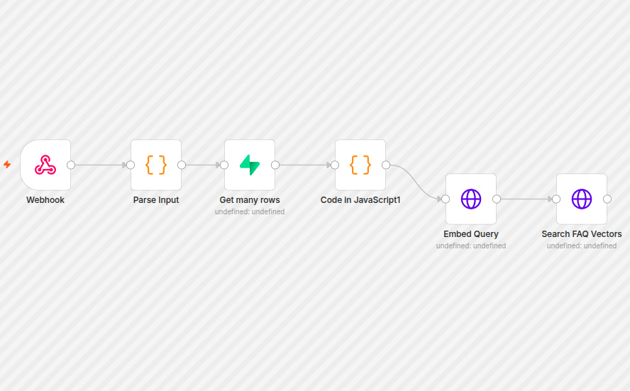
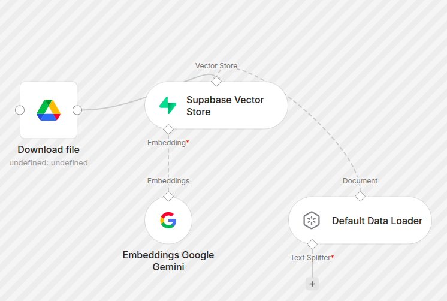

# BookLeaf AI Customer Query Bot

A RAG based customer query bot built with n8n, Supabase (pgvector), and Google Gemini. Incoming customer questions are embedded and matched against a vector store of FAQ content, so answers stay grounded in the company's own documents instead of the model's general knowledge.

Built as two n8n workflows, one for ingestion and one for querying.

## Architecture





## Workflow 1, FAQ Ingestion (one time)

Loads the FAQ source document and populates the vector store.

1. Downloads the FAQ document from Google Drive, converting it to PDF
2. Passes it through the Default Data Loader, which splits the document into chunks
3. Embeds each chunk with Google Gemini
4. Inserts the embeddings into the `faq_vectors` table in Supabase

Run once, or whenever the FAQ document changes.

## Workflow 2, Query Bot v2

Handles an incoming customer question end to end.

1. **Webhook** receives a POST with `channel`, `sender_email`, and `query`
2. **Parse Input** normalizes the payload, lowercasing and trimming the email and trimming the query
3. **Get many rows** looks up the sender in the `authors` table in Supabase
4. **Code in JavaScript** builds a single object carrying `author_found`, the author record if present, and the original query, so downstream nodes have both identity and question context
5. **Embed Query** converts the question to a vector using `gemini-embedding-001`
6. **Search FAQ Vectors** calls the `match_faq_vectors` Postgres function to retrieve the top 3 most similar FAQ chunks

## Design notes

- Author lookup is non blocking. If the sender is not found, `author_found` is set to false and the flow continues, so an unknown sender still gets an answer.
- Input normalization happens before the database lookup, which avoids misses caused by casing or stray whitespace in email addresses.
- Vector search is capped at 3 matches to keep retrieved context tight and relevant.

## Stack

n8n, Supabase with pgvector, Google Gemini embeddings, Google Drive API

## Setup

1. Import both JSON files into n8n
2. Create a Supabase table `faq_vectors` with a vector column and a `match_faq_vectors` function for similarity search
3. Set the following environment variables, or replace the header values with n8n credentials

```
GEMINI_API_KEY
SUPABASE_SECRET_KEY
```

4. Replace `YOUR_PROJECT_REF` in the Search FAQ Vectors node with your Supabase project reference
5. Replace `YOUR_DOC_ID` in the ingestion workflow with your FAQ document ID
6. Run the ingestion workflow once, then activate the query bot workflow

## Status

Work in progress. Answer generation and confidence scoring on top of the retrieved chunks are still being built. The current flow covers ingestion through retrieval.
